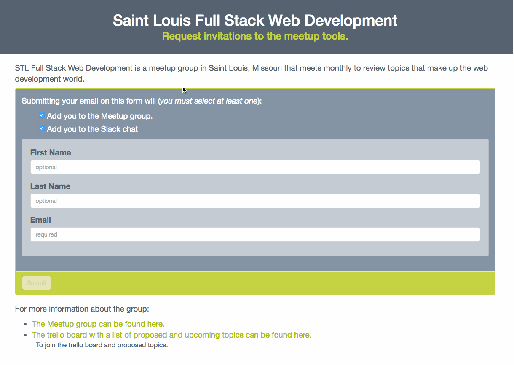

# Slack Signup Form demo

This is a demo of a project that I plan to build at the next [Saint Louis Full Stack Web Development Meetup Group](http://www.meetup.com/SaintLouis_FullStack_WebDevelopment/) hack night.

This project could be refactored and cleaned up further, but I may leave this demo/prototype here and plan the fixes for the actual project.

## What it does

The idea is a site that allows for one spot to sign up and add yourself to the meetup group and to it's slack chat. This could be refactored to add additional invites to services. 

In addition to in inviting the user to the meetup group and adding them to the slack team, it also notifies admins of the new invitee and sends a message to a specific channel in the slack team. 

Once the request is validated and the data is stored, the invites and messages are queued with amazon SQS for processing later. Note that handing off to SQS is a an environment specific configuration, but the tools and .env configuration access are in place.

Database records are stored using UUID primary keys.

I imagine the actual implementation of this project will be extended to do different things over time which is why the views and routes are namespaced.

## What all is packed in here?

This project uses the following tools:

- [Laravel](laravel.com)
- [Laravel Elixir](https://laravel.com/docs/5.2/elixir)
- [Amazon SQS](https://aws.amazon.com/sqs/)
- [Ramsey UUID](https://github.com/ramsey/uuid)
- [Gulp](http://gulpjs.com/)
- [Browserify](http://browserify.org/)
- [Vue.js](http://vuejs.org/)
- [Vueify](https://github.com/vuejs/vueify)
- [vue-resource](https://github.com/vuejs/vue-resource)
- [vue-form](https://github.com/fergaldoyle/vue-form)
- [Bootstrap Sass](https://www.npmjs.com/package/bootstrap-sass)
- [Animate.css](https://daneden.github.io/animate.css/)
- [Font Awesome](http://fontawesome.io/)

## Mockup, Workflow, and ERD

- The draw.io mockup, workflow, and ERD for this project can be found here:
	- [https://drive.google.com/file/d/0Bxhfk2Nciu7jSnBfeVBVUnBWYUU/view?usp=sharing](https://drive.google.com/file/d/0Bxhfk2Nciu7jSnBfeVBVUnBWYUU/view?usp=sharing). 
- The Trello board I'm using to plan the project can be found here:
	- [https://trello.com/b/Q6oLwm4x/stlfullstack-website-tool](https://trello.com/b/Q6oLwm4x/stlfullstack-website-tool)